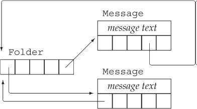

# CS100 Recitation 10

GKxx

---

## Contents

- Homework 5 讲评
- 拷贝控制

---

## 502

从简单到难：swapcase < strip < join ≈ split （我个人认为）

错误类型：WA>RE>CE >> TLE >> MLE

---

### swapcase

谨防“二极管”！

```c++
std::string swapcase(std::string str){
    for (char &c:str){
        if (std::isupper(c)){
            c -= 'A' - 'a';
        }else {
            c += 'A' - 'a // 非黑即白？
        }
    }
    return str;
}
```

（当然，使用std::tolower/toupper不会出现此类问题，因为里面会判断）

---

### strip

---

## 

### 绝大多数TLE的原因

Pic from Homework 4:

```cpp
for (int i = 0; i < strlen(s); ++i) 
```

STL不是万能的，它不是所有函数都是一下就能完成。

举例：std::string.erase(),std::string.substr()

如果你在循环里不断调用诸如此类函数......


---

# 拷贝控制

---

## 拷贝控制操作（三/五法则）

拷贝控制相关的操作有：
- 析构函数 `~T()` 
- 拷贝构造函数 `T(const T&)`
- 拷贝赋值运算符 `T& operator=(const T&)`
- 移动构造函数 `T(T&&) noexcept`
- 移动赋值运算符 `T& operator=(T&&) noexcept`

五法则：如果你需要使用（自定义）其中任何一个，那么全部五个都会需要。

---

## 析构函数 `~T()` 

在对象被销毁的时候自动调用
- 临时变量离开作用域
- 动态分配的对象被 `delete`
- 容器中的元素、对象中的成员
  
先执行函数体，再以成员在类中被定义的顺序的逆序进行销毁。

- 与构造函数正好相反：
  ```cpp
  Dynarrray(std::size_t n)
    : m_size(n), m_storage(new int[n]{}) {}
  ```
  先按类中定义的顺序初始化 `m_size` 与 `m_storage`， 再执行函数体，即空的`{}`。

如不定义，编译器自动生成的析构函数为空函数体 `{}`。不执行任何额外操作，只逆序销毁成员（依次调用成员的析构函数）。若不定义，则无法 `delete m_storage`。

---

## 拷贝构造函数 `T(const T&)`

是一种**构造函数**。即便声明成 `T(const T&) = default;` 也不是默认构造函数。
- 默认构造函数是没有参数的构造函数。

在**初始化一个新对象**时，如果使用的是另一个现有的对象，则会调用：
```cpp
Dynarray old;
Dynarray new1(old);
Dynarray new2 = old; // 有一个等号，看起来像赋值，但实际上是拷贝初始化。
void foo(Dynarray arr) { /* ... */ }
foo(old); // 用 old 拷贝构造 arr。
```

如不定义，编译器自动生成：**拷贝初始化**所有成员，不进行任何额外操作。
```cpp
Dynarray(const Dynarray& other):
  m_size(other.m_size), m_storage(other.m_storage) {}
```
自动生成的拷贝构造函数错误地使两个 `Dynarray` 对象的 `m_storage` 指向相同的位置。

---

## 拷贝赋值运算符 `T& operator=(const T&)`

是一种 `operator=` 运算符。
在使用 `=` 为一个**现有的对象**赋值时，如果使用的是另一个现有的对象，则会调用：
```cpp
Dynarray a, b;
a = b;
a = a; // 自赋值（self-assignment）!
```
直接的写法：
```cpp
Dynarray& operator=(const Dynarray& other) {
  delete m_storage;
  m_storage = new int[other.m_size]{};
  // ...
  return *this;
}
```
自赋值会引起错误！使用 `if(this != &other)` 来跳过自赋值。

---

## 拷贝赋值：copy-and-swap

更好的拷贝方式。
- 复用拷贝构造函数，不容易遗漏成员
- 即使不跳过自赋值也不会引起错误
  
思想：将 `other` 先复制一份到临时变量 `temp`，再将自己与 `temp` 交换。原先自己的资源将交给 `temp`，在离开作用域时自动销毁。

```cpp
Dynarray& operator=(const Dynarray& other) {
  Dynarray temp(other);
  // 将自己与temp交换...
  return *this;
}
```
`std::swap` 可以用于交换两个同类型数据，但要求可移动构造（`move-constructable`）并可移动赋值（`move-assignable`）。在没有定义移动赋值函数时，我们无法直接 `std::swap` 两个 `Dynarray`，但可以手动 `std::swap` 所有成员。


---

## 拷贝赋值：copy-and-swap

定义 `swap` 成员函数，手动 `std::swap` 所有成员：
```cpp
class Dynarray {
  // ...
  void swap(Dynarray& other) {
    std::swap(m_storage, other.m_storage);
    std::swap(m_size, other.size);
  }
  Dynarray& operator=(const Dynarray& other) {
    Dynarray temp(other);
    swap(temp); // 将自己与temp交换！
    return *this;
  }
};
```
可以最终简化成：
```cpp
Dynarray(other).swap(*this); // 创建temp，并将temp与自己交换。
return *this;
```

---

## 移动构造函数 `T(T&&) noexcept`

在**初始化一个新对象**时，如果使用的是一个将不再需要使用的对象（右值），则调用：
```cpp
std::vector<std::string> strings;
std::string a = "Not used anymore!";
std::string str = std::move(a); // 使用 a 移动构造 str。
strings.push_back(std::move(str)); // 移动：std::move 将 str 视作右值：不再需要使用。
strings.push_back("Hello"); // 移动：std::string("Hello") 生成临时的 string 对象。
```
`push_back` 会向 `vector` 添加新元素。在它为右值引用 `T&&` 重载的版本中，`vector` 中的这个新元素会使用参数（`std::move(str)` 或 `"hello"`）移动构造。

在没有定义移动构造而定义了拷贝构造时，`T a(std::move(b))` 会使用拷贝构造函数。
- 正确地完成了需要做的事情，但代价是一次不需要的拷贝。
  
只有在5项拷贝控制相关函数都没有定义的时候，编译器会自动生成一份移动构造函数，尝试移动初始化所有成员，形如 `m_storage(std::move(other.m_storage))`。

---

## 为什么一定要有 `noexcept` ？

`noexcept` 关键词告诉编译器，这个函数不会抛出异常。
- 因为移动构造函数并不额外分配资源而只是“窃取”不再使用的资源，移动操作通常不会抛出任何异常。
- 将移动函数标记为 `noexcept` 可以允许标准库安全地使用你定义的移动操作。
  
如果有一个 `std::vector` 需要将旧的元素移动到新的空间中，它需要保证，即使移动到一半出现异常，它自身也不应发生改变。
- 拷贝操作可以保证这一点，但移动操作不可以。
- 所以，移动操作需要保证不抛出异常，否则编译器将无法安全地使用移动操作而选择拷贝。

---

## 移动赋值运算符 `T& operator=(T&&) noexcept`

在使用 `=` 为一个**现有的对象**赋值时，如果使用的是一个将不再需要使用的对象（右值），则会调用：
```cpp
std::string a, b;
a = std::move(b);
std::string sayHello() {
  return std::string("Hello");
}
a = sayHello();
std::vector<std::string> strings;
for (const auto& s : strings) {
  a = std::move(a) + s; // move 防止了执行加号时的额外复制。加号的运算结果会移动赋值给a。
}
```

同样，只有在5项拷贝控制相关函数都没有定义的时候，编译器才会自动生成移动赋值运算符。

---

## 拷贝控制：实例
在 `Dynarray` 中，我们需要自定义拷贝控制成员，因为我们的类分配了额外的资源。除了这种场合，拷贝控制也可以用在其他设计当中。

例如，我们需要设计两个用来处理邮件消息的类，`Message` 和 `Folder`。一条 `Message` 可以存在于多个 `Folder` 中，但是它必须只有一份。如果一条 `Message` 的内容被改变，每个 `Folder` 中都可以看到改变后的内容。

<div style="display: grid; grid-template-columns: 1fr 1fr;">
  <div>

<a align="center">
  
</a>
  </div>

  <div>

  每个 `Folder` 中显然需要保存所有 `Message`。因为同一份 `Message` 不应产生多个副本，所以需要保存的为 `Message*` 。同时，我们也需要为每个 `Message` 记录它存在于哪些 `Folder` 中，以正确地从这些 `Folder` 中移除  `Message`。这同样应当存储指向 `Folder` 的指针 `Folder*`。

  </div>
</div>

---

## `Message` 类设计

```cpp
class Message {
public:
  Message(const std::string& str = "");
  Message(const Message& other);
  ~Message();
  Message& operator=(const Message& other);
private:
  std::string m_contents;
  std::vector<Folder*> m_folders;
}
```


---

## 拷贝一个新 `Message`： 

```cpp
  void addToFolders(const Message& msg) {
    for (const auto& f : msg.m_folders) {
      f->addMsg(this);
    }
  }

  Message(const Message& other) 
  : m_contents(other.m_contents), m_folders(other.m_folders) {
    addToFolders(other);
  }
```

---

## `~Message()`

```cpp
  void removeFromFolders() {
    for (const auto& f : m_folders) {
      f->removeMsg(this);
    }
  }
  ~Message() {
    removeFromFolders();
  }
```

---

## 拷贝赋值运算符
简单的写法：
```cpp
Message& operator=(const Message& other) {
  removeFromFolders();
  if (this != &other) {
    m_contents = other.contents;
    m_folders = other.folders;
  }
  addToFolders(other);
}
```

更好的写法：copy-and-swap。

---

## `friend` 友元

```cpp
class A {
  friend class B;
  // ...
private:
  int m_private;
};

class B {
public:
  void fun(A object) {
    a.m_private = 0;
  }
};
```
---

## 自定义 `cout` : 非友元

```cpp
class Dynarray {
public:
  // ...
private:
  size_t m_size;
  int* m_storage;
};

std::ostream& operator<<(std::ostream& os, Dynarray arr) {
  os << "[";
  for (size_t i = 0; i < arr.size(); ++i) {
    os << arr.at(i);
    if (i != arr.size() - 1) {
      os << ", ";
    }
  }
  os << "]" << std::endl;
  return os;
}

Dynarray a(5);
std::cout << a << std::endl; // [0, 0, 0, 0, 0] 
```

---

## 自定义 `cout`

```cpp
class Dynarray {
public:
  friend std::ostream& operator<<(std::ostream& os, Dynarray arr);
  // ...
private:
  size_t m_size;
  int* m_storage;
};

std::ostream& operator<<(std::ostream& os, Dynarray arr) {
  os << "[";
  for (size_t i = 0; i < arr.m_size; ++i) {
    os << arr.m_storage[i];
    if (i != arr.m_size - 1) {
      os << ", ";
    }
  }
  os << "]" << std::endl;
  return os;
}

Dynarray a(5);
std::cout << a << std::endl; // [0, 0, 0, 0, 0]  
```
