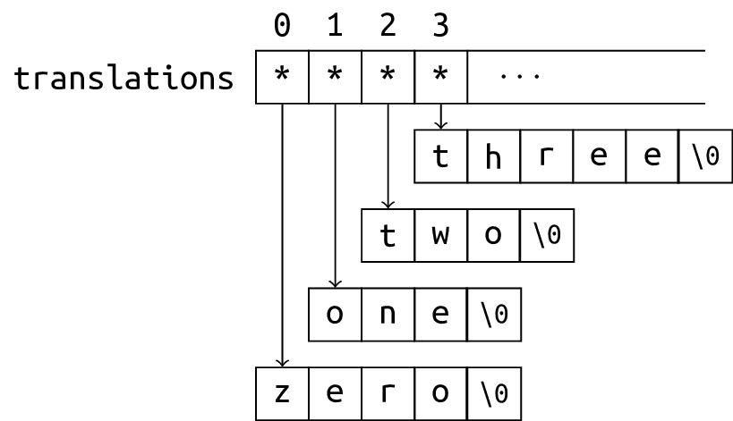

# CS100 Recitation 4

GKxx

---

## Contents

- 如何debug(调试)
- 指针和数组（续）
- 字符串
- 动态内存

---

# 如何debug(调试)

---

## 关于debug

猜猜程序员花在debug上的时间占多少比例？
  

---

## 关于debug

猜猜程序员花在debug上的时间占多少比例？

- 接近50%！
---

## Debug方法

- 干瞪眼法
  - 逐行观察，尝试发现bug在哪里。（通常不起作用） 
- 寻求编译器帮助
  - 我们已经开启了-Werror，将不规范（可能有bug）的地方当作error。编译器不通过并提示你在哪一行。（只能解决少数问题）
- printf法
  - 在代码中插入多个printf，把想要查看的变量值打印出来，或查看代码的控制流
  - 推荐print时加入标识方便识别：`printf("m的值是%d\n", m);`
  - 好用！但是代码修改起来太麻烦了……
- debugger（调试器）
  - 断点暂停、逐行运行、查看变量……


---

```c
int main(void) {
    char word[10];
    word[0] = 'H';
    word[1] = 'i';

    int len = strlen(word);
    if (len = 0) {
        return 0;
    }
    else {
        for (int i = 0; i < len; i++) {
            printf("%c\n", word[i]);
        }
    }
}
```
---

```c
int main(void) {
    char word[10];
    word[0] = 'H';
    word[1] = 'i';

    int len = strlen(word);
    if (len = 0) {
        return 0;
    }
    else {
        for (int i = 0; i < len; i++) {
            printf("%c\n", word[i]);
        }
    }
}
```
-Werror会告诉你：
```
error: suggest parentheses around assignment used as truth value [-Werror=parentheses]
   14 |     if (len = 0) {
```

---

## printf法

```c
int main(void) {
    char word[10];
    word[0] = 'H';
    word[1] = 'i';

    int len = strlen(word);
    printf("长度是%d\n", len);
    if (len = 0) {
        return 0;
    }
    else {
        printf("运行到else里了！\n");
        for (int i = 0; i < len; i++) {
            printf("%c\n", word[i]);
        }
    }
    printf("运行到结束了！\n");
}
```

---

## Debugger(调试器)

如果你用的是CLion或VS等IDE（集成开发环境），它会帮你配置好！

如果你配置的是VScode+minGW，你需要让VScode找到你安装的debugger。

- 随minGW安装的调试器叫gdb。你可以在使用gcc编译代码时加入-g来开启调试功能
- 编译完成后不直接运行程序，而让gdb去打开程序即可进入debug。

VScode: 右上角运行按钮中选择调试C/C++文件，然后选择gdb并生成配置文件。
**如果不能正常运行，就删掉tasks.json重新生成！**
运行会跳到“调试控制台”，可能需要切到“终端”进行scanf等输入。

---

## 我的代码没交过，可本地都没问题呀，我直接开始debug吗？

什么，这不是debug，这是……

**需要先找到bug，才能debug！**
找到出现bug的情况的过程叫做测试(testing)。在测试出现有问题的case之后，再去逐行运行代码定位问题在哪里。

*给的case我都过了……*

需要具备制造强case的能力。

- 数据范围：最大值、最小值、特殊值
- 需要特殊处理的情况
- 针对你写得最复杂的代码片段
- ……


---
# 指针和数组

---

## 指针类型

对于两个不同的类型 `T` 和 `U`，指针类型 `T *` 和 `U *` 是**不同的类型**（尽管它们有可能指向相同的地址）。

```c
int i = 42;
float *fp = &i;
*fp += 1; // undefined behavior
```

尽管在 C 中，不同类型的指针之间可以相互（隐式）转换（在 C++ 中必须显式转换），但如果一个指针指向的对象和它被声明的类型不符，解引用这个指针几乎总是 undefined behavior。

- 除了[一些情况](https://en.cppreference.com/w/c/language/object#Strict_aliasing)（稍后会看到一种）

---

## `void *`：“指向 `void` 的指针”

> 埏埴以为器，当其无，有器之用。——老子《道德经》

- 任何指针都可以（隐式）转换成 `void *`
- `void *` 可以（隐式）转换成任何指针
- 可以用 `printf("%p", ptr)` 输出一个 `void *` 类型的指针 `ptr` 的值。
  - 如果 `ptr` 是其它类型的指针，需要先转换：`printf("%p", (void *)ptr)`

**\* 注意：`scanf` 和 `printf` 的 conversion specifier 如果和对应的变量类型（在 [default promotion](https://en.cppreference.com/w/c/language/conversion#Default_argument_promotions) 之后）不匹配，则是 undefined behavior。**
- 不能认为 `printf("%f", ival)` 等价于 `printf("%f", (float)ival)`（试一试）

---

## `void *`

在没有 C++ 那样强的静态类型系统支持下，`void *` 经常被用来表示“任意类型的指针”、“（未知类型的）内存的地址”，甚至是“任意的对象”。

- `malloc` 的返回值类型就是 `void *`，`free` 的参数类型也是 `void *`。
- `pthread_create` 允许给线程函数传任意参数，方法就是用 `void *` 转交。
- 在 C 中，接受 `malloc` 的返回值时**不需要显式转换**。

**`void *` 是 C 类型系统真正意义上的天窗**

---

## 向函数传递数组

C 语言**没有办法**声明一个数组参数（为什么？），所以传递数组的唯一方式是传递**指向数组首元素的指针**。

以下四种声明是**完全等价的**：参数 `a` 的类型是 `int *`。（如何验证？）

```c
void fun(int *a);
void fun(int a[]);
void fun(int a[10]);
void fun(int a[2]);
```

---

## 向函数传递数组

C 语言**没有办法**声明一个数组参数（为什么？），所以传递数组的唯一方式是传递**指向数组首元素的指针**。

以下四种声明是**完全等价的**：参数 `a` 的类型是 `int *`。（如何验证？）

```c
void fun(int *a);
void fun(int a[]);
void fun(int a[10]);
void fun(int a[2]);
```

验证：使用 `sizeof` 获得一个变量或类型所占的字节数。

---

## 向函数传递数组

就算以数组的形式声明一个参数，它的类型也是一个普通的指针：传递任何一个地址给它都是合法的，传递任何大小的数组给它也是合法的。

> 为何使用 `scanf`、`gets` 之类的函数读取字符串被视为不安全的？

为了让函数知道这个数组究竟有多长，常见的方法是**显式地传递一个参数 `n`**：

```c
void print_array(int *a, int n) {
  for (int i = 0; i != n; ++i)
    printf("%d ", a[i]);
}
```

**\* 指针也能用下标？** 看看[标准](https://en.cppreference.com/w/c/language/operator_member_access#Subscript)


---
## 返回数组

C 语言也**没有办法**返回一个数组。

不是说数组可以退化成指针吗？`int* get_array()`可以吗？

- 指针指向的临时变量在函数结束时就会被销毁！指针成为野指针。
  
我偷偷学了个关键词叫`static`？

- 静态变量不会被销毁，但是会造成每次执行这个函数都留有上次运行的数据。
  
我用`malloc`分配新的动态内存！

- 调用这个函数的人需要知道你分配了内存，并且需要`free`掉！
- `malloc`和`free`的责任分给了写代码的人和用代码的人？

---
## 返回数组

标准库给出的答案：将需要返回的数组放在函数参数位置，由用户创建好放进来。

`char *strcpy( char *dest, const char *src );`


---

## 向函数传递数组

练习：设计并编写一个函数，将一个整数数组里的奇数倒序拷贝给另一个数组。

---

## 向函数传递数组

练习：设计并编写一个函数，将一个整数数组里的奇数倒序拷贝给另一个数组。

```c
void copy_odd_reversed(int *from, int n, int *to) {
  for (int i = n - 1, j = 0; i >= 0; --i)
    if (from[i] % 2 == 1)
      to[j++] = from[i];
}
```

---

## 退化

- 数组向指向首元素指针的隐式转换（退化）：
  - `Type [N]` 会退化为 `Type *`
- “二维数组”其实是“数组的数组”：
  - `Type [N][M]` 是一个 `N` 个元素的数组，每个元素都是 `Type [M]`
  - `Type [N][M]` 应该退化为什么类型？

---

## 退化

- 数组向指向首元素指针的隐式转换（退化）：
  - `Type [N]` 会退化为 `Type *`
- “二维数组”其实是“数组的数组”：
  - `Type [N][M]` 是一个 `N` 个元素的数组，每个元素都是 `Type [M]`
  - `Type [N][M]` 退化为“指向 `Type [M]` 的指针”
- 如何定义一个“指向 `Type [M]` 的指针”？

---

## 稍微复杂一点儿的复合类型

<div style="display: grid; grid-template-columns: 1fr 1fr;">
  <div>

指向数组的指针
```c
int (*parr)[N];
```
  </div>
  <div>

存放指针的数组
```c
int *arrp[N];
```
   </div>
</div>

- 首先，记住**这两种写法都有，而且是不同的类型**。
- `int (*parr)[N]` 为何要加一个圆括号？当然是因为 `parr` 和“指针”的关系更近
  - 所以 `parr` **是指针**，
  - 指向的东西是 `int [N]`
- 那么另一种则相反：
  - `arrp` **是数组**，
  - 数组里存放的东西是指针。

---

## 向函数传递二维数组

以下声明了**同一个函数**：参数类型为 `int (*)[N]`，即一个指向 `int [N]` 的指针。

```c
void fun(int (*a)[N]);
void fun(int a[][N]);
void fun(int a[2][N]);
void fun(int a[10][N]);
```

可以传递 `int [K][N]` 给 `fun`，其中 `K` 可以是任意值。
- 第二维大小必须是 `N`。 `Type [10]` 和 `Type [100]` 是不同的类型，指向它们的指针之间不兼容。

---

## 向函数传递二维数组

以下声明中，参数 `a` 分别具有什么类型？哪些可以接受一个二维数组 `int [N][M]`？

1. `void fun(int a[N][M])`
2. `void fun(int (*a)[M])`
3. `void fun(int (*a)[N])`
4. `void fun(int **a)`
5. `void fun(int *a[])`
6. `void fun(int *a[N])`
7. `void fun(int a[100][M])`
8. `void fun(int a[N][100])`

---

## 向函数传递二维数组

以下声明中，参数 `a` 分别具有什么类型？哪些可以接受一个二维数组 `int [N][M]`？

1. `void fun(int a[N][M])`：指向 `int [M]` 的指针，可以
2. `void fun(int (*a)[M])`：同 1
3. `void fun(int (*a)[N])`：指向 `int [N]` 的指针，**不可以**
4. `void fun(int **a)`：指向 `int *` 的指针，**不可以**
5. `void fun(int *a[])`：同 3
6. `void fun(int *a[N])`：同 3
7. `void fun(int a[100][M])`：同 1
8. `void fun(int a[N][100])`：指向 `int [100]` 的指针，当且仅当 `M==100` 时可以

---

## 向函数传递二维数组

练习：定义一个函数 `transpose`，接受一个 $N\times M$ 的二维数组 `a`，和一个 $M\times N$ 的二维数组 `b`，将 `a` 的转置存入 `b`。

---

## 向函数传递二维数组

练习：定义一个函数 `transpose`，接受一个 $N\times M$ 的二维数组 `a`，和一个 $M\times N$ 的二维数组 `b`，将 `a` 的转置存入 `b`。

```c
void transpose(int a[N][M], int b[M][N]) {
  for (int i = 0; i != M; ++i)
    for (int j = 0; j != N; ++j)
      b[i][j] = a[j][i];
}
```

---

## `const`

`const` 变量：**一经初始化就不能再改变**（“常量”），所以当然**必须初始化**.

- “常量”这个词其实很容易引发歧义，C/C++ 中还有一种真正的“常量”，是指**值在编译期已知的量**。

可以定义“指向常量的指针”：`const Type *ptr` 或 `Type const *ptr`

---

## pointer-to-`const`

一个“指向常量的指针”也可以指向一个 non-`const` variable

- 但它**自以为**自己指向了“常量”，所以不允许你通过它修改它所指向的变量。
  
  ```c
  int i = 42;
  const int *cip = &i;
  int *ip = &i;
  ++i;    // OK
  ++*ip;  // OK
  ++*cip; // Error
  ```
- “底层 `const`”（low-level `const`）

---

## pointer-to-`const`

不能用 pointer-to-non-`const` 指向一个真正的 `const` 变量，也不能用一个 pointer-to-`const` 给它赋值或初始化（“不能去除底层 `const`”）

- 如果把 `const` 视为一把锁，这就是在试图拆掉锁。
- 你可以用 explicit cast（显式转换）强行拆锁，但由此引发的对于 `const` 变量的修改是 undefined behavior

<div style="display: grid; grid-template-columns: 1fr 1fr;">
  <div>

```c
const int ci = 42;
int *ip = (int *)&ci;
++*ip; // Undefined behavior
```
  </div>
  <div>

```c
int i = 42;
const int *cip = &i;
int *ip = cip; // Warning in C, Error in C++
int *ip2 = (int *)cip; // OK
```
  </div>
</div>

---

## 顶层 `const`（top-level `const`）

一个指针自己是 `const` 变量：它永远指向它初始化时指向的那个对象

有时称为“常量指针”

```c
int ival = 42;
int *const ipc = &ival;
++*ipc; // Correct
int ival2 = 35;
ipc = &ival2; // Error. ipc is not modifiable.
```

当然也可以同时带有底层、顶层 `const`：

```c
const int *const cipc = &ival;
```

---

## 总结

- 不要随意转换不同类型之间的指针，极易引发 undefined behavior
- `void *` 是万金油，可以接受一切指针，向一切指针转换（类型系统的天窗）
  - 用 `"%p"` 输出 `void *`
  - 通常用来表示“任何指针”、“某片内存的地址”（“内存”不谈类型）、“任何参数”等。
- 二维数组 `Type [N][M]` 会退化为 `Type (*)[M]`，即“指向 `Type [M]` 的指针”
  - `Type *a[M]` 是“存放 `Type *` 的数组”
  - 声明一个二维数组参数 `Type [N][M]` 时，`N` 随意（反正会退化为指针），但 `M` 必须和传进来的实参的对应维度大小相等。

---

## 总结

- 底层 `const`：（自以为）指向的东西是 `const`
  - `const Type *ptr` 或 `Type const *ptr`
  - 有可能其实指向了一个 non-`const`，但它不管
  - 不允许通过这个指针修改它所指向的变量
- 顶层 `const`：自己是不可修改的 `const` 变量
  - `Type *const ptr`
  - 初始化的时候指向谁，就永远指向谁，不可修改

---

# 字符串

---

## “C 风格字符串”（C-style strings）

C 语言没有对应“字符串”的抽象，字符串就是一群字符排在一起。
- 可以是数组，也可以是动态分配的内存
- **末尾必须有一个 `'\0'`，`'\0'` 在哪末尾就在哪。**

```c
char s[10] = "abcde";  // s = {'a', 'b', 'c', 'd', 'e', '\0'}
printf("%s\n", s);     // abcde
printf("%s\n", s + 1); // bcde
s[2] = ';';            // s = "ab;de"
printf("%s\n", s);     // ab;de
s[2] = '\0';
printf("%s\n", s);     // ab
```

---

## ~~愚蠢的~~结束符 `'\0'`

`'\0'` 是所谓的“空字符”，其 ASCII 值为 `0`。

C 风格字符串结束的**唯一**判断标志
- 我们已经知道，一维数组被传递给函数时会退化，长度信息根本带不进去。

**C 语言标准库的所有处理字符串的函数都会去找 `'\0'`**
- 缺少 `'\0'` 会让他们不停地走下去，（很可能）导致越界访问。

用数组存储字符串时，记得为空字符多开一格。

```c
char s[5] = "abcde"; // OK, but no place for '\0'.
puts(s); // undefined behavior (missing '\0')
```

---

## 字符串 IO

- `scanf`/`printf`：`"%s"`
  - `scanf` 读 `"%s"` 有内存安全问题：它并不知道你传给它的数组有多长
  - `scanf` 没被踢出去，（我猜）是因为它还有别的用途
- `gets`：**自 C11 起被踢出标准**，因为它只有这一个用途
  - 替代品 `gets_s` 在标准的附录里，很遗憾 GCC 没有支持它
- [`fgets`](https://en.cppreference.com/w/c/io/fgets)：更通用，更安全

  ```c
  char str[100];
  fgets(str, 100, stdin);
  ```
- `puts(str);` 输出字符串 `str` 并换行

---

## 求字符串的长度

练习：实现你自己的 `strlen` 函数，接受一个字符串（起始位置的指针），返回这个字符串的长度。

**字符串的“长度”不算末尾的空字符，任何时候都是这样。**

---

## 求字符串的长度

练习：实现你自己的 `strlen` 函数，接受一个字符串（起始位置的指针），返回这个字符串的长度。

<div style="display: grid; grid-template-columns: 1fr 1fr;">
  <div>

```c
size_t my_strlen(const char *str) {
  size_t ans = 0;
  while (*str != '\0') {
    ++ans;
    ++str;
  }
  return ans;
}
```
  </div>
  <div>

```c
size_t my_strlen(const char *start) {
  const char *end = start;
  while (*end != '\0')
    ++end;
  return end - start;
}
```
  </div>
</div>

---

## 求字符串的长度

练习：实现你自己的 `strlen` 函数，接受一个字符串（起始位置的指针），返回这个字符串的长度。

```c
size_t my_strlen(const char *str) {
  size_t ans = 0;
  while (*str++ != '\0') // 理解这个看起来很秀的写法
    ++ans;
  return ans;
}
```

- 甚至可以 `while (*str++)`（为什么？），但不好。

---

## 千万不能这样写！

```c
for (size_t i = 0; i < strlen(s); ++i)
  // ...
```
每次循环体执行完毕时，都要执行一次判断条件 `i < strlen(s)`，而每次算 `strlen(s)` 都需要遍历整个字符串，**非常慢**（时间复杂度为 $O\left(n^2\right)$）

**应该改为**

```c
int n = strlen(s);
for (int i = 0; i < n; ++i)
  // ...
```

---

## 一个小问题

```c
for (int i = 0; i < strlen(s); ++i)
  // ...
```
编译器在 `i < strlen(s)` 上报了个 warning？
- `strlen` 返回值类型为 `size_t`：无符号整数
- 将 `int` 和 `size_t` 放在一起运算/比较时，**`int` 值会被转换为 `size_t` 类型**
  - `-1 < strlen(s)` 几乎肯定是 `false`

**\* 不要混用带符号数和无符号数**

---

## 字符串字面值 (string literals)

字符串字面值：类似这种 `"abcde"`（**双引号！！！**）
- 类型为 `char [N+1]`，其中 `N` 是它的长度，`+1` 是为了放空字符。
- **但它会被放在只读的内存区域**（可能是 `.rodata`），所以它实际上应该带 `const`
  - 在 C++ 中，它的类型是 `const char [N+1]`，非常合理。

用不带底层 `const` 的指针指向一个 string literal 是合法的，但**极易导致 undefined behavior**：

```c
char *p = "abcde";
p[3] = 'a'; // undefined behavior, and possibly runtime-error.
```

---

## 字符串字面值 (string literals)

用不带底层 `const` 的指针指向一个 string literal 是合法的，但**极易导致 undefined behavior**：

```c
char *p = "abcde";
p[3] = 'a'; // undefined behavior, and possibly runtime-error.
```

正确的做法：

<div style="display: grid; grid-template-columns: 1fr 1fr;">
  <div>

加上底层 `const` 的保护
```c
const char *str = "abcde";
```
  </div>
  <div>

或者将内容拷贝进数组
```c
char arr[] = "abcde"; 
```
  </div>
</div>

---

## 字符串数组

```c
const char *translations[] = {
  "zero", "one", "two", "three", "four",
  "five", "six", "seven", "eight", "nine"
};
```

<div style="display: grid; grid-template-columns: 1fr 1fr;">
  <div>

- `translations` 是一个数组，存放的元素是指针，每个指针都指向一个 string literal
- `translations` **不是二维数组！**
  </div>
  <div>
    <a align="center">
      
    </a>
  </div>
</div>

---

## 标准库函数

[完整列表](https://en.cppreference.com/w/c/string/byte)，你想要的都在这里

常见的几个：

- `strcmp(s1, s2)` 按字典序 (lexicographical order) 比较两个字符串的大小。
  - 如果 `s1`“小于”`s2`，返回**一个负数**
  - 如果相等，返回 `0`
  - 如果 `s1`“大于”`s2`，返回**一个正数**
  - **不可以认为它的返回值 $\in\{-1,0,1\}$！！！**

---

## 标准库函数

- `strcpy(to, from)` 将 `from` 的内容拷贝给 `to`。
- `strtol`, `strtoll`, `strtoul`, `strtoull`, `strtof`, `strtod`, `strtold`：将一个以字符串形式表示的整数/浮点数的值提取出来。
  - 这些是 `atoi`、`atol` 等函数的替代品，**能自定义进制**，且有更好的错误处理
  - C23 还有 `strfromf` 之类的函数

**\* 一个很好的练习是实现自己的 `strcpy`、`strcmp` 等函数**

---

## 标准库函数

`<ctype.h>` 里有一些识别、操纵单个字符的函数：
- `isdigit(c)` 判断 `c` 是否是数字字符
- `isxdigit(c)` 判断 `c` 是否是十六进制数字字符
- `islower(c)` 判断 `c` 是否是小写字母
- `isspace(c)` 判断 `c` 是否是空白（空格、回车、换行、制表等）
- `toupper(c)`：如果 `c` 是小写字母，返回其大写形式，否则返回它本身

---

## 总结

C 风格字符串是**以空字符结尾的**字符数组（或动态分配的连续内存）

- 永远不要忘记空字符
- 字面值不能修改，尽管它不带 `const`
  - 建议用带底层 `const` 的指针指向字面值
- IO：`scanf`/`printf`, `fgets`, `puts`
- `strcmp`, `strlen`, `strcpy`
- 数字字符串的转换：`strtol`, `strtoll` 等
- `<ctype.h>` 一些处理单个字符的函数

---

# 动态内存

---

## 使用 `malloc` 和 `free`

创建一个“动态数组”：大小在运行时确定

```c
Type *ptr = malloc(sizeof(Type) * n);
for (int i = 0; i != n; ++i)
  ptr[i] = /* ... */
// ...
free(ptr);
```

---

## 使用 `malloc` 和 `free`

也可以动态创建一个对象

```c
int *ptr = malloc(sizeof(int));
*ptr = 42;
// ...
free(ptr);
```

但是为什么需要这样？直接创建 `int ival = 42;` 不香吗？

---

## 使用 `malloc` 和 `free`

动态创建对象的好处：**生命期跨越作用域**

```c
int *create_array(void) {
  int a[N];
  return a; // 返回了一个指向局部变量 a 的指针
            // 当函数返回时，局部变量 a 已经被销毁，该地址无意义
            // 解引用这个指针将导致 undefined behavior
}
int *create_array2(int n) {
  return malloc(sizeof(int) * n); // OK. 动态分配的内存直到被 free 才被销毁
}
```

---

## 使用 `malloc` 和 `free`

动态创建一个“二维数组”？

<div style="display: grid; grid-template-columns: 1fr 1fr;">
  <div>

```c
int **p = malloc(sizeof(int *) * n);
for (int i = 0; i != n; ++i)
  p[i] = malloc(sizeof(int) * m);
for (int i = 0; i != n; ++i)
  for (int j = 0; j != m; ++j)
    p[i][j] = /* ... */
for (int i = 0; i != n; ++i)
  free(p[i]);
free(p);
```
  </div>
  <div>
    <a align="center">
      
    </a>
  </div>
</div>


---

## 使用 `malloc` 和 `free`

动态创建一个“二维数组”——另一种方法：创建一维数组

```c
int *p = malloc(sizeof(int) * n * m);
for (int i = 0; i != n; ++i)
  for (int j = 0; j != m; ++j)
    p[i * m + j] = /* ... */
// ...
free(p);
```

---

## `malloc`, `calloc` 和 `free`

看标准！[`malloc`](https://en.cppreference.com/w/c/memory/malloc) [`calloc`](https://en.cppreference.com/w/c/memory/calloc) [`free`](https://en.cppreference.com/w/c/memory/free)

```c
void *malloc(size_t size);
void *calloc(size_t num, size_t each_size);
void free(void *ptr);
```

- `calloc` 分配的内存大小为 `num * each_size`（其实不一定，但暂时不用管）
- `malloc` 分配**未初始化的内存**，每个元素都具有未定义的值
  - 但你可能试来试去发现都是 `0`？这是巧合吗？
- `calloc` 会将分配的内存的每个字节都初始化为零。
- `free` 释放动态分配的内存。在调用 `free(ptr)` 后，`ptr` 具有**未定义的值**（dangling pointer）

---

## `malloc`, `calloc` 和 `free`

`malloc(0)`, `calloc(0, N)` 和 `calloc(N, 0)` 的行为是 **implementation-defined**

- 有可能不分配内存，返回空指针
- 也有可能分配一定量的内存，返回指向这个内存起始位置的指针
  
  - 但解引用这个指针是 undefined behavior
  - 这个内存同样需要记得 `free`，否则也构成内存泄漏

---

## 正确使用 `free`

- 忘记 `free`：内存泄漏，OJ 上无法通过测试。
- `free(ptr)` 的 `ptr` 必须是之前由 `malloc`, `calloc`, `realloc` 或 C11 的 `aligned_alloc` 返回的一个地址
  - 必须指向动态分配的内存的**开头**，不可以从中间某个位置开始 `free`
  - 会释放由 `ptr` 开头的整片内存，它自有办法知道这片内存有多长
- `free` 一个空指针是**无害的**，不需要额外判断 `ptr != NULL`
- `free` 过后，`ptr` 指向**无效的地址**，不可对其解引用。再次 `free` 这个地址的行为 (double free) 是 undefined behavior。

---

## 为何需要动态内存？

- `malloc`, `calloc` 等函数分配的是**堆内存**，而作为局部变量的数组使用的是**栈内存**
- 通常来说栈内存比堆内存小，大对象通常建议分配在堆上
  
  - 但也不是没办法调整
- 关键：堆上创建的对象不受作用域限制，什么时候 `free` 就什么时候销毁
  - 写一个函数 `slice`，接受一个字符串和两个下标 `l`, `r`，返回这个字符串的下标范围为 $[l,r)$ 的子串（切片）？

---

## 切片

写一个函数 `slice`，接受一个字符串和两个下标 `l`, `r`，返回这个字符串的下标范围为 $[l,r)$ 的子串（切片）？


```c
char *slice(const char *str, int l, int r) {
  ??? result = ???;
  for (int i = l; i < r; ++i)
    result[i - l] = str[i];
  result[r - l] = '\0';
  return result;
}
```

如何存储这个结果？

---

## 用数组？

**不要返回局部变量的地址！**

```c
char *slice(const char *str, int l, int r) {
  char result[100];
  for (int i = l; i < r; ++i)
    result[i - l] = str[i];
  result[r - l] = '\0';
  return result;
}
```

`result` 在函数执行完毕时就被销毁了，访问这个地址就是访问无效的内存！

（而且这个 `100` 真的够大吗？也有待商榷）

---

## 动态分配内存？

似乎唯一可行的方法是

```c
char *slice(const char *str, int l, int r) {
  char *result = malloc(sizeof(char) * (r - l + 1));
  for (int i = l; i < r; ++i)
    result[i - l] = str[i];
  result[r - l] = '\0';
  return result;
}
```

但这样的代码极易引发内存泄漏：**用户必须自己记得释放这个内存**

---

## 动态分配内存？

```c
/* read the file mode in octal */
param = getfield(tf);
mode = cvlong(param, strlen(param), 8);

/* read the user id */
uid = numuid(getfield(tf));

/* read the group id */
gid = numgid(getfield(tf));

/* read the file name (path) */
path = transname(getfield(tf));

/* insist on end of line */
geteol(tf);
```

如果程序中充斥着这些默默分配内存的函数，内存泄漏将取得彻头彻尾的胜利！

---

## 问题

```c
char *slice(const char *str, int l, int r) {
  char *result = malloc(sizeof(char) * (r - l + 1));
  for (int i = l; i < r; ++i)
    result[i - l] = str[i];
  result[r - l] = '\0';
  return result;
}
```

根本的问题是：**内存的分配和释放不由同一个人完成**

有没有一种叫做“字符串”的东西来自己管理好这个内存？

---

## 问题

根本的问题是：**内存的分配和释放不由同一个人完成**

有没有一种叫做“字符串”的东西来自己管理好这个内存？

- 上个世纪人们已经把这个问题讨论完了：
  
  《C Traps and Pitfalls》《Ruminations on C++》

C 标准库的解决方案：干脆让用户自己创建存放结果的内存，把这个地址传进来

- ```c
  char *strcpy(char *restrict dest, const char *restrict source);
  ```